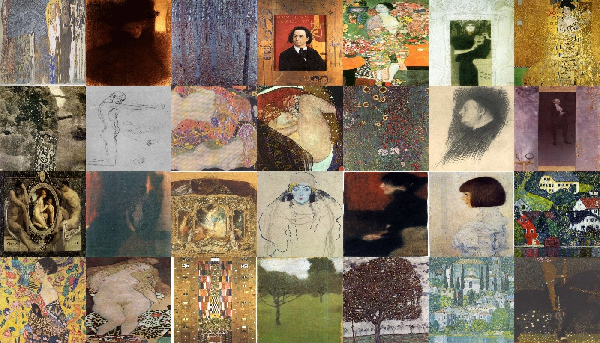
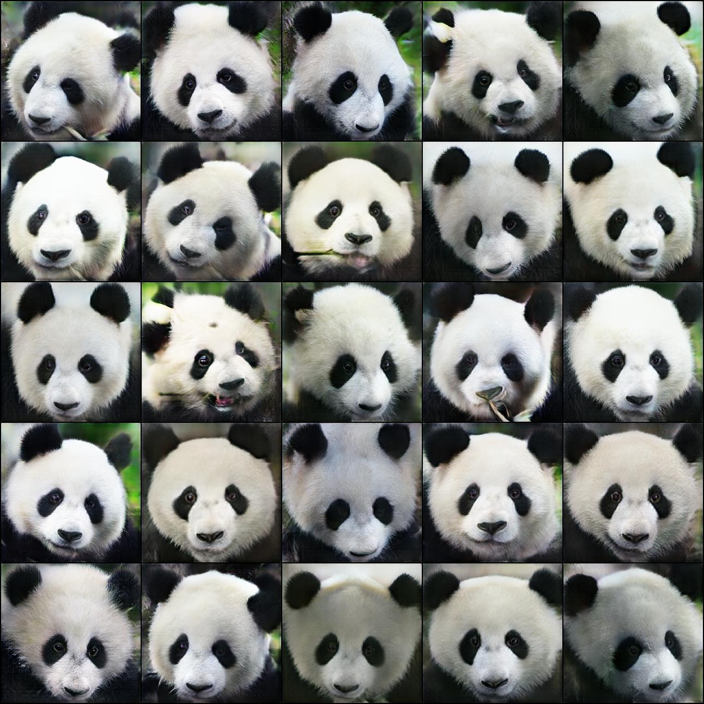
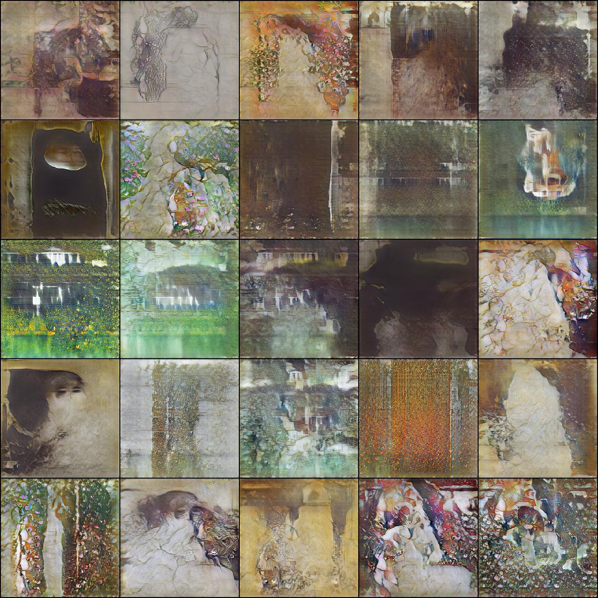
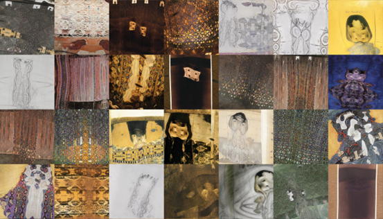

# Artistic Image Generation Using Generative Adversarial Networks

The focus is on generating pictures in the style of <a href="https://www.wikiart.org/en/gustav-klimt">Gustav Klimt.</a>
The main problems were:
- the limited size of the available training dataset(consisting of 161 pictures that were made by Gustav Klimt)
- the limited computing power(single Nvidia GeForce GTX 1070)

Furthermore, Gustav Klimt's paintings are quite diverse, which, coupled with the limited dataset for learning, further complicates the generation of images in his style. Part of the extensive body of work by Gustav Klimt can be seen in the following picture.




## Light-weight GAN
Simple implementation of light-weight GAN structure proposed in <a href="https://openreview.net/forum?id=1Fqg133qRaI">'Towards Faster and Stabilized GAN Training for High-fidelity Few-Shot Image Synthesis'</a>, in PyTorch. The main contributions of the paper include a Skip-Layer Excitation (SLE) module in the generator and a self-supervised discriminator trained as a feature-encoder with an additional decoder.

The SLE module leverages low-scale activations to revise the channel responses on high-scale feature maps. SLE allows a more robust gradient flow throughout the model weights for faster training. It also leads to an automated learning of a style/content disentanglement like StylEGAN2.

Additionally, data augmentation is used because it's so effective in stabilizing the training when using small datasets. An improvement is likely with the introduction of other augmentations, incorporating adaptive control of the augmentation strength (probability) as seen in StyleGAN2-ADA.



256x256 Pictures of pandas generated in about 16 hours of training on a single GPU. The training dataset consisted of 100 pictures.




256x256 Pictures of Klimt generated in about 16 hours of training on a single GPU. 

The panda pictures are of much better quality than the Klimt pictures, leading to the conclusion that the diversity of the training set is too high for the model (the model isn't complex enough).


## Transfer learning with the Style-GAN3 model

Transfer learning resulted in generated pictures of better quality, but the training took over 11 days on the single GPU for the 1024x1024 model and more than 2 days for the 256x256 model. Training setup from: https://github.com/NVlabs/stylegan3 



256x256 Klimt pictures generated with a StyleGAN3-r model that was pretrained on pictures of faces <a href="https://catalog.ngc.nvidia.com/orgs/nvidia/teams/research/models/stylegan3/files">(FFHQ-U).</a>


1024x1024 Klimt pictures generated with a StyleGAN3-t model that was pretrained on <a href="https://github.com/justinpinkney/awesome-pretrained-stylegan3#wikiart-1024">WikiArt.</a>

The 1024x1024 pictures personally look better and they get a better score on the KID (Kernel Inception Distance) metric which should be better for smaller datasets than FID. This can probably be attributed to the greater diversity of the dataset used to train the 1024x1024 model. Furthermore, achieving better results should be possible through fine-tuning of hyperparameters.


## Citations

```bibtex
@inproceedings{
liu2021towards,
title={Towards Faster and Stabilized {\{}GAN{\}} Training for High-fidelity Few-shot Image Synthesis},
author={Bingchen Liu and Yizhe Zhu and Kunpeng Song and Ahmed Elgammal},
booktitle={International Conference on Learning Representations},
year={2021},
url={https://openreview.net/forum?id=1Fqg133qRaI}
}
```